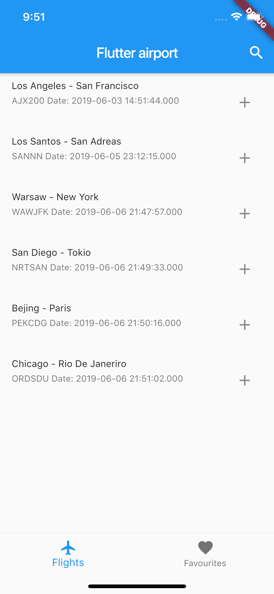
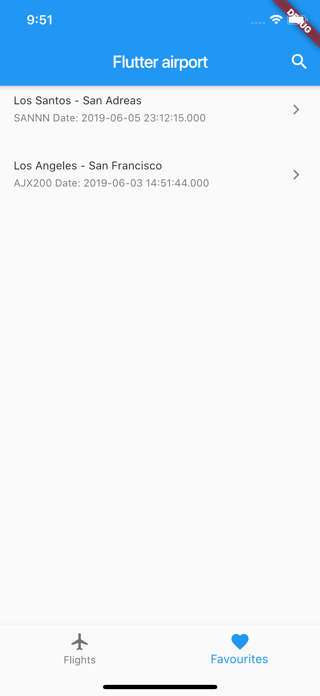
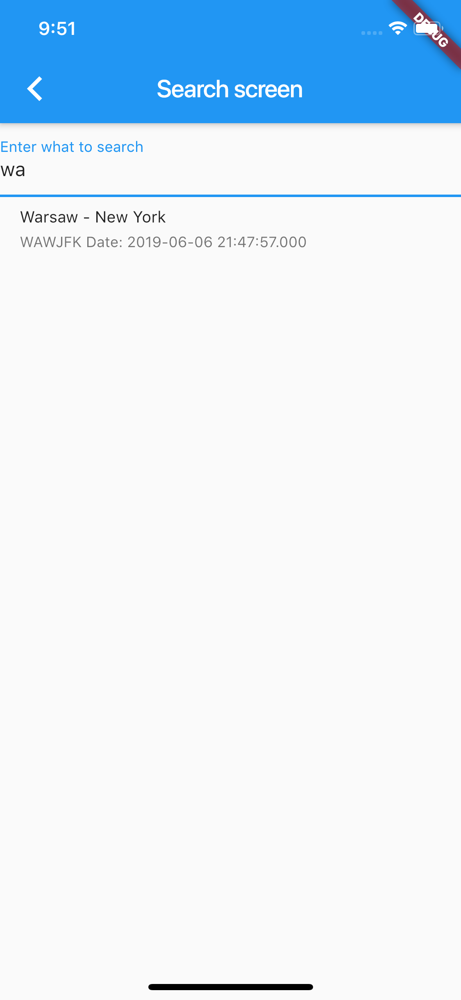
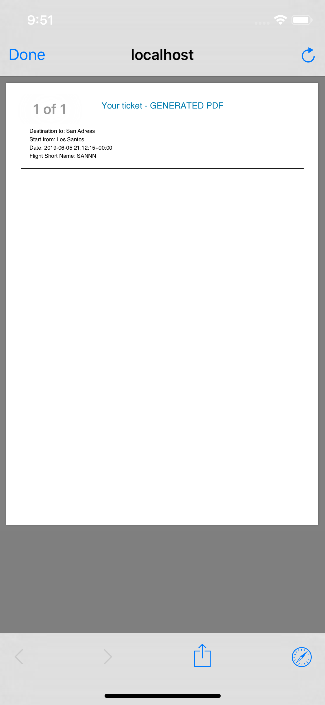

# Airport Flutter

This is my first flutter project based on [bloc library](https://felangel.github.io/bloc/#/).

Project works on custom written API.

# Getting started
For help getting started with Flutter, view our online
[documentation](http://flutter.io/).

For changing url go to `utils/constants`

Used Flutter version: `1.5.4-hotfix.2`

# Some Screens

